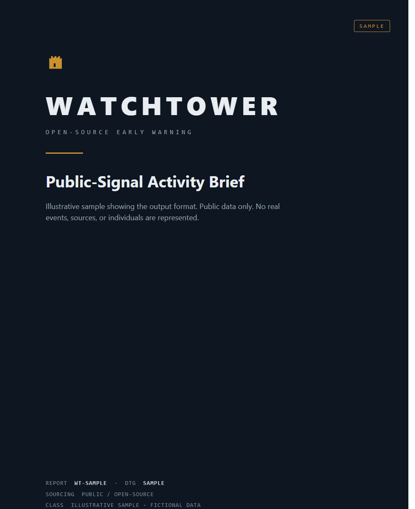
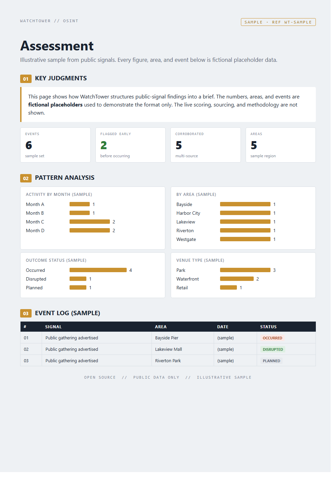
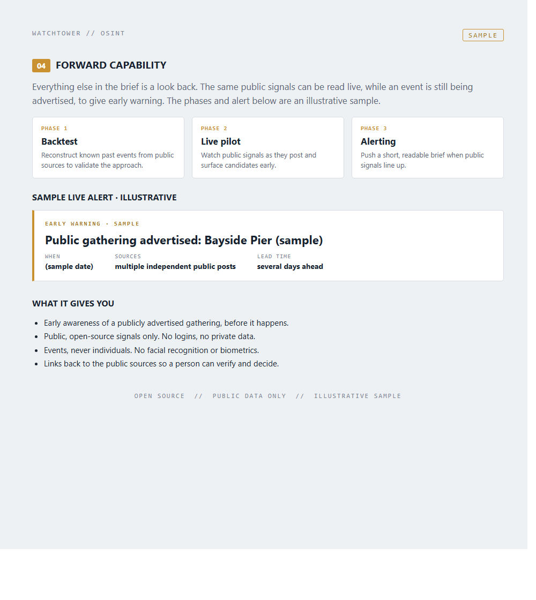
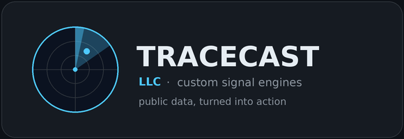

# WatchTower

Open-source early warning for publicly advertised mass gatherings.

Large, unsanctioned gatherings rarely come out of nowhere. They are organized and promoted in the
open, on public social media, days before they happen, and the original posts tend to disappear
once the crowd arrives. The people who have to plan for the strain on a community are often the
last to know.

WatchTower closes that gap. It reads public, open-source signals, separates real disorder-trend
events from benign look-alikes, reads the event flyers, and turns the advertising window into lead
time. The output is a short, structured intelligence brief that a person can act on before the
event, not after it.

This is a forward-looking tool. The value is not documenting what already happened. It is surfacing
what is being organized for next weekend while there is still time to plan for it.

## What it is built to do

- Detect publicly advertised gatherings early, while they are still being promoted.
- Separate a real disorder-trend event from a sanctioned or benign one. A city parks-and-rec teen
  night is not the same thing as a flash gathering, and the tool is built to tell them apart.
- Read flyers and posts for the place, date, and time.
- Rank events by how many independent public sources corroborate the same one.
- Render it as a concise brief with a confidence level, sourced back to the public posts.

## Guardrails come first

These are not an afterthought. They are what separates a useful early-warning tool from a liability.

- Public, logged-out sources only. No logins, no fake accounts, no private data.
- Events, never individuals. No facial recognition, no biometrics, ever.
- Decision support, not prediction of people. It flags advertised events, not persons.
- Links back to public sources, with minimal retention.
- Not crime prediction, and not built for enforcement or evidence.

## A look at the output

Illustrative samples. Fictional data, public format only.







## How it is put together

High level only. The collection logic, prompts, and scoring are private.

```
watchtower/
├── collect/     pull public, open-source signals across platforms
├── classify/    sort real trend events from benign look-alikes, with a confidence level
├── extract/     read flyer images for place / date / time
├── score/       rank events by how many independent public sources agree
└── report/      render the brief (PDF)
```

## Tech

Python, a large-language model for reading flyer images and sorting signals, public search, and
automated PDF generation.

## Status

Working prototype, built and tested against real, publicly advertised events. The implementation
and methodology are private. This repo is an overview of what it does and why it exists.

Built by Tracecast LLC.

---


